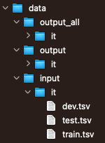

## Overview
This repository contains the source code and the models used for [Shared task on Multilingual Grammatical Error Detection (MultiGED-2023)](https://github.com/spraakbanken/multiged-2023).
The model is described in the paper 
[EliCoDe at MultiGED2023: fine-tuning XLM-RoBERTa for multilingual grammatical error detection](paper_link).
This repository was built based on the code from the repository [Clinical Transformer NER](https://github.com/uf-hobi-informatics-lab/ClinicalTransformerNER). We have extended the framework by allowing the use of the XLM-RoBERTa model; we release the code to use such model only. If you are interested in exploiting other models please refer to the original repository.

## Prerequisites
#### 1 - Install Requirements
```
conda env create -f environment.yml
```
NB. It requires [Anaconda](https://www.anaconda.com/distribution/)

#### 2 - Download pre-trained models and fine-tuned models
Download models from ["Google Drive"](https://drive.google.com/drive/folders/1K2EzW57ieyISyIY1dVfiM2JQf0dTXfZU?usp=sharing) and unpack the archive in the data folder. The shared task data can be downloaded from the [MultiGED-2023 official repository](https://github.com/spraakbanken/multiged-2023).
An example of a data folder structure might look like the following:

where the data folder contain two sub-directories:
- `input` containing a folder for each language e.g. `it` for Italian where train/test/dev original files can be stored;
- `output` containing a folder for each language e.g. `it` for Italian where model and predictions can be stored;
- `output_all` containing a folder for each language e.g. `it` for Italian where model and predictions for the *ALL* experimental setting can be stored.


## Execution
In order to produce the submission files the following steps are needed:
1. convert TSV format (used within the competition) to BIO format;
2. run the training of the model;
3. use the trained model to predict the labels in the BIO format;
4. convert the BIO format to TSV so as to be compliant with the submission format the submission.

#### 1. Convert TSV format (used within the competition) to BIO format
In order to convert from the original TSV format to the BIO format, which is accepted by our system, you can use the script `src/format_conversion/convert_tsv_to_bio.py`. The script accepts three arguments:
- --language_folder - the path to a folder containing train/test/dev.tsv for a single language e.g. `data/input/it/`;
- --output_folder - the path to a folder where the BIO files will be saved e.g. `data/output/it/`;
- --output_folder_all - the path to a folder where the BIO files for the *ALL* experimental setting will be saved e.g. `data/output_all/it/`.
Usasge example from the directory `src/format_conversion/`:
```shell script
python convert_tsv_to_bio.py \
 --language_folder ../../data/input/it/ \
 --output_folder ../../data/output/it/ \
 --output_folder_all ../../data/output_all/it/
```

#### 2. Run the training of the model
In order to run the training of the XLM-RoBERTa based sequence classifier you can use the script `src/run_roberta_token_classification.py`. The script accepts several parameters that are listed below:
`--model_type, --pretrained_model, --data_dir, --new_model_dir, --overwrite_model_dir, --max_seq_length, --save_model_core, --do_train, --model_selection_scoring, --train_batch_size, --eval_batch_size, --train_steps, --learning_rate, --num_train_epochs, --gradient_accumulation_steps, --do_warmup, --seed, --warmup_ratio, --max_num_checkpoints, --log_file, --progress_bar, --early_stop, --do_predict, --predict_output_file, --new_model_dir` 

The most relevant parameters are described in the following:
- --pretrained_model - the name of the model to train or a path to a pre-trained mode directory;
- --data_dir - the directory containing train/test/dev files in the BIO format e.g. `/data/output/it/` NB. the files **must** be named train.txt, test.txt and dev.txt;
- --new_model_dir - the directory where the trained model will be saved e.g. `data/output/it/roberta_model/`;
- --num_train_epochs - the number of training epochs;
- --train_batch_size - the number of element in the training batch;
- --eval_batch_size - the number of element in the evaluation batch on dev set.
To a complete description of the parameters please refer to the [original documentation](https://github.com/uf-hobi-informatics-lab/ClinicalTransformerNER/wiki/Parameters).
Usasge example from the project home (EliCoDe):
```shell script
 python src/run_roberta_token_classification.py \
 --model_type xlm-roberta \
 --pretrained_model xlm-roberta-large \
 --data_dir ./data/output/it/ \
 --new_model_dir ./data/output/it/roberta_model/ \
 --overwrite_model_dir \
 --max_seq_length 512 \
 --save_model_core \
 --do_train \
 --model_selection_scoring strict-f_score-1 \
 --train_batch_size 4 \
 --eval_batch_size 4 \
 --train_steps -1 \
 --learning_rate 1e-5 \
 --num_train_epochs 10 \
 --gradient_accumulation_steps 1 \
 --do_warmup \
 --seed 13 \
 --warmup_ratio 0.1 \
 --max_num_checkpoints 3 \
 --log_file ./data/output/it/log_roberta_train.txt \
 --progress_bar \
 --early_stop 5
```

#### 3. Predict the labels in the BIO format with a trained model
In order to run the prediction of the XLM-RoBERTa based sequence classifier you can use the same script used for training `src/run_roberta_token_classification.py`. This script can be used with models we trained to address the competition.
The most relevant parameters are described in the following:
- --pretrained_model - the path to the directory containing a previously trained model `data/output/it/roberta_model/`;
- --predict_output_file - the path to the file where predictions will be saved;
- --new_model_dir - as for the *pretrained_model* argument, indicates the path to the directory containing a previously trained model `data/output/it/roberta_model/`.
Usasge example from the project home (EliCoDe):
```shell script
 python src/run_roberta_token_classification.py \
  --model_type xlm-roberta \
  --pretrained_model ./data/output/it/roberta_model/ \
  --data_dir ./data/output/it/ \
  --do_predict \
  --predict_output_file ./data/output/it/roberta_preds.txt \
  --max_seq_length 512 \
  --model_selection_scoring strict-f_score-1 \
  --seed 13 \
  --log_file ./data/output/it/log_roberta_test.txt \
  --progress_bar\
  --new_model_dir ./data/output/it/roberta_model/;
```

#### 4. Convert the BIO format to TSV
The last step consists in converting the predictions from the BIO format to the TSV format used within the competition. In order to run shch conversione you can use the script `src/format_conversion/convert_bio_to_tsv.py`. The script accepts three arguments:
- --bio_file - the path to the BIO file to convert e.g. `data/output/it/roberta_preds.txt`;
- --tsv_file - the path to the original TSV format file, this is used to check the aligment between the bio_file and the output file e.g. `data/input/it/test.tsv`;
- --output_file - the path to the output file, where the conversion will be saved e.g. `data/output/it/it_preds.txt`.
Usasge example from the directory `src/format_conversion/`:
```shell script
python convert_bio_to_tsv.py \
 --bio_file ../../data/output/it/roberta_preds.txt \
 --tsv_file ../../data/input/it/test.tsv \
 --output_file ../../data/output/it/it_preds.txt
```

## Run the baseline

In order to run the baseline you can use the script `src/baseline/multiged_baseline.py`. The script accepts two argumens:
- --language_folder - the path to a folder containing train/test/dev files in the TSV format e.g. `data/input/it/`;
- --output_folder - the path to a folder where the predictions will be stored e.g. `data/output/it/`.
Usage example from the directory `src/baseline/`
```shell script
python multiged_baseline.py \
 --language_folder ../../data/input/it/ \
 --output_folder ../../data/output/it/
```

## Reference
Citation:
```
@InProceedings{
}
```